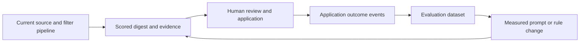

# Job Hunter: tools, agents, and development priorities

Research date: **9 September 2026**. This is a review of the current checkout plus sources retrieved on that date, not a claim about releases later in September. Recommendations and proposed acceptance criteria below are engineering judgments, not measured improvements.

**Recommendation: develop Job Hunter into an evidence-backed job-search assistant with a feedback loop. Keep its Python pipeline, use a small toolset for development, and prioritize reliable processing, evaluation, and application outcomes.** An autonomous agent framework migration has no demonstrated benefit for this workload.

## What exists today

The repository serves one person's daily EU job search. Its flow is source collection → deduplication → hard filters → tracker gate → fit scoring → document tailoring → PDF generation → optional application → persistence → HTML digest. The source roster includes eight ATS families, regional feeds, optional Adzuna, and LinkedIn alerts ingested through Gmail. The [README](../README.md) describes the source roster; [run_pipeline](../src/main.py) at `src/main.py:555–743` establishes the actual stage order.

| Existing capability | Evidence | Implication |
|---|---|---|
| Injectable tracker, clock, source selection, and LLM client | `src/main.py:555–743` | Evaluation and replay can wrap existing functions. |
| Scoring schema support, malformed-result handling, fallback-model attribution | `src/scoring.py:397–480` | Extend existing validation; do not propose structured output as wholly missing. |
| Candidate positioning, positive signals, and score caps | `src/scoring.py:185–236` | Caps are **prompt instructions**. The parser clamps to 0–100 but does not enforce individual candidate caps. |
| CV and cover-letter validation, corrective retry, base-CV fallback | `src/tailor.py:721–850` | Add evidence and evaluation around the existing safeguards. |
| Per-run LLM usage and model display | `src/main.py:714–719`, `src/digest.py:720–744` | Cost reporting already exists; improve attribution only where it answers a decision. |
| SQLite tracker and duplicate-submission protections | [Architecture contract](ARCHITECTURE.md), tracker section | Preserve SQLite and its application-state semantics. |
| Graft integration | `.mcp.json`, `.cursor/mcp.json`, `.claude/skills/graft/SKILL.md`, `AGENTS.md` | Both inspected MCP configuration files name only `graft`. This does not describe every globally installed connection. |

Graft indexed 65 Python files: 26 source files and 39 test files, with 2,376 symbols and 7,329 edges. These are graph counts, not a count of every repository artifact.

**Validation:** `.venv/bin/python -m pytest -q` exited successfully. Collection confirmed 2,078 selected tests and 69 network tests deselected; the execution showed 2,076 passes, one skip, and one expected failure. This verifies the offline suite, not current ATS endpoints or real-model output quality. The current virtual environment reports **Python 3.9.6**, while `pyproject.toml` declares **Python >=3.10**. urllib3 also emitted a LibreSSL compatibility warning. Rebuild the development environment with a supported interpreter and rerun the baseline before dependency or integration changes.

## Highest-value engineering opportunities

The architecture worker identified five opportunities. These are source-based failure modes and design gaps, not measured production incidents.

| Order | Change | Why it matters and where it belongs | Acceptance evidence |
|---|---|---|---|
| 1 | **Durable scoring backlog and retry states** | `scoring.max_jobs` truncates a batch (`src/scoring.py:519–534`); a later run applies freshness again before scoring (`src/main.py:610–655`). Overflow can age out. A scoring failure is deliberately surfaced as `DIGEST`, but that state also suppresses resurfacing during the reminder window (`src/scoring.py:483–491`, `src/db.py:108–118,576–598`). | Offline scenarios recover after a provider outage and retain overflow across the freshness boundary. Distinguish pending processing, human visibility, expired/closed postings, and submission state. Do not retry an application because scoring retried. |
| 2 | **Selective description enrichment** | SmartRecruiters enriches only the first N adapter results before the pipeline filters them (`src/sources/ats_boards.py:1499–1562`). LinkedIn email cards may start with empty descriptions (`src/sources/linkedin_email.py:344–363`); optional enrichment already exists. | Apply cheap gates first, then bounded cached enrichment before description-dependent filters and scoring. Measure full/snippet/missing coverage and requests per useful job; keep failures visible. |
| 3 | **Human decisions and recruiting outcomes** | Current statuses represent pipeline/submission results; `record_status` updates a current row (`src/models.py:329–348`, `src/db.py:435–483`). | Manual applications participate in duplicate protection; independent timestamped events preserve recruiter outcomes without replacing submission history. |
| 4 | **Versioned evaluation records** | Tracker persistence stores job metadata and latest score/reasons, but lacks enough immutable input/version evidence to reconstruct an evaluation (`src/db.py:235–270,435–483`, `src/main.py:504–529`). Producing-model attribution already exists in memory. | Replay a held-out labeled set with model, prompt, candidate-rule and CV fingerprints. Store only the protected snapshots needed for reproduction. |
| 5 | **Health at company-board and stage level** | Existing health aggregates source totals and error strings (`src/health.py:214–281`); healthy boards can obscure one broken board under the same vendor. | Digest explains board failures, description coverage, backlog and stage duration using typed results. Preserve existing source-level alerts and scheduler checks. |

This sequence addresses lost or delayed opportunities before expanding the number of sources. For backlog processing, retain the original posting date and revalidate availability; an old queued job must not be presented as newly published.

## MCP and service shortlist

MCP exposes capabilities to an agent; a skill teaches a workflow; an API or SDK implements a runtime integration. These serve different purposes. The scheduled job pipeline should continue calling ordinary Python integrations where that is already reliable.

| Priority | Tool | Specific value here | Adoption boundary |
|---|---|---|---|
| Keep | **Graft** | Locate source contracts, inspect callers, and scope changes before reading code. | Existing local CLI works. Use its MCP surface when available; do not duplicate the graph with another memory service. |
| High | **GitHub connector or official GitHub MCP** | Inspect upstream ATS-related issues, dependency changes, repository PRs, and CI failures. | The GitHub connector worked in this research. Add the server only in clients that lack equivalent access. Limit toolsets and use read-only access for research. [Official server](https://github.com/github/github-mcp-server). |
| High | **Context7** | Look up documentation matching dependency versions during adapter, browser, or SDK maintenance. | Send library names and technical questions, without applicant data. It supports MCP and CLI/skills setup; an API key increases available rate limits. [Official project](https://github.com/upstash/context7). |
| High after dataset | **Promptfoo CLI; optional MCP** | Compare ranking prompts and models against labeled jobs through a Python wrapper. | Start with the CLI. MCP adds agent-driven evaluation inspection and execution after an eval project exists. Keep evaluation sharing disabled for applicant material; model-backed runs consume provider budget. [Python integration](https://www.promptfoo.dev/docs/integrations/python/), [MCP tools](https://www.promptfoo.dev/docs/integrations/mcp-server/). |
| Targeted | **Python browser QA; optional Playwright CLI or MCP** | Reproduce changing ATS forms and inspect digest layout on fixtures. | Start with the existing Python library plus the skill below. Microsoft recommends considering CLI/skills for coding-agent efficiency; MCP suits persistent interactive exploration. Keep the production implementation. Give concurrent browser workers separate isolated sessions. [Official comparison and configuration](https://github.com/microsoft/playwright-mcp). |
| Pilot | **Tavily search/extract** | Find careers pages for employers whose boards the current discovery process cannot resolve. | Validate public leads against employer/ATS pages, then propose watchlist additions. MCP is useful during exploration; a production feature should use a bounded direct API adapter. [Official MCP](https://docs.tavily.com/documentation/mcp), [Search API](https://docs.tavily.com/documentation/api-reference/endpoint/search). |
| Later | **Phoenix or equivalent tracing** | Diagnose model regressions across prompts, retries, latency, and outcomes if plain logs become inadequate. | Begin with run/job/model/prompt-version metadata in the current pipeline. A self-hosted tracing stack is optional operational overhead, not a prerequisite. Avoid recording raw CV/email content by default. [Phoenix](https://arize.com/docs/phoenix), [self-hosting configuration](https://arize.com/docs/phoenix/self-hosting/configuration). |

Context7's retrieved pricing lists 1,000 calls/month free, or $10/seat/month for 5,000 included calls with $10 per additional 1,000. Start with the free allowance; private repository indexing is unnecessary because Graft covers the local code. This is a dated price observation, not a subscription recommendation. [Pricing](https://context7.com/plans).

For a Tavily pilot, use a fixed employer sample, basic search, explicit result limits, and no generated answer. Its published allowance is 1,000 credits/month free; basic search is one credit, basic extraction one credit per five successful URLs, and pay-as-you-go is $0.008/credit. With efficient extraction batching, 100 searches plus 100 extracted URLs would use about 120 credits under those rates. This is illustrative arithmetic, not a measured bill. Compare verified new employers, false matches, stale postings, and cost per useful addition. A search engine's publication or crawl date is not a job's posting date. [Credits and pricing](https://docs.tavily.com/documentation/api-credits).

**Alternatives assessed:** Exa is a credible search/content alternative to benchmark if the pilot underperforms; installing two overlapping search services initially adds little evidence. Firecrawl is a later option for extracting known public careers pages when ordinary ATS feeds and existing enrichment fail. Neither was benchmarked here, so Tavily is a proposed first experiment, not an accuracy winner. [Exa MCP](https://exa.ai/docs/reference/exa-mcp), [Firecrawl MCP](https://docs.firecrawl.dev/mcp-server).

**Gmail is a dated exception worth recording.** Google now documents an official remote Gmail MCP server in **Developer Preview**, with search/read, draft, and label tools. Its setup requests `gmail.readonly` and `gmail.compose`. That is broader than this ingestion task needs. Keep the existing direct OAuth adapter (`src/sources/linkedin_email.py:489–657`), which already refreshes tokens and reads alerts. Revisit MCP only for a separate interactive triage requirement, after verifying the minimum supported scopes and tool set. A mailbox search query is not a permission boundary. [Google's current setup guide](https://developers.google.com/workspace/gmail/api/guides/configure-mcp-server).

Langfuse MCP is also deferred: it operates on an existing Langfuse project's data, so adding it does not instrument this application. Its documentation offers a skill alternative for agents with shell access. Choose a tracing backend only when the simpler metrics prove insufficient. [Official Langfuse MCP documentation](https://langfuse.com/docs/api-and-data-platform/features/mcp-server).

## Skills worth using

The find-skills review checked actual skill instructions, official repositories, and available adoption metadata. Counts below are snapshots retrieved on 9 September; installs are directory telemetry and stars are repository-wide. Neither proves correctness. The review did not audit every bundled executable or dependency.

| Selection | Why it fits | Evidence and adoption snapshot |
|---|---|---|
| **Keep Graft and Orca orchestration** | Graft provides repository context; Orca tracks task ownership, worker reports and cleanup. | Both were exercised in this review. The repo already has a Graft skill and root instructions. |
| **Trial `promptfoo-evals` + `promptfoo-provider-setup`** | Teach agents to wrap the real Python functions, author deterministic assertions, select a venv, and inspect evaluation failures. | Official Promptfoo bundle; approximately 24,960 repository stars; skill install count **not established**. [Bundle documentation](https://www.promptfoo.dev/docs/integrations/agent-skill/), [eval instructions](https://github.com/promptfoo/promptfoo/blob/main/plugins/promptfoo/skills/promptfoo-evals/SKILL.md), [provider instructions](https://github.com/promptfoo/promptfoo/blob/main/plugins/promptfoo/skills/promptfoo-provider-setup/SKILL.md), [repository metadata](https://api.github.com/repos/promptfoo/promptfoo). |
| **Trial `anthropics/skills:webapp-testing`** | Its native Python Playwright workflow suits static digest HTML and synthetic ATS forms. | About 152.8K installs and 175,318 repository stars. Use the project interpreter and page-specific readiness checks. [Directory entry](https://skills.sh/anthropics/skills/webapp-testing), [actual instructions](https://github.com/anthropics/skills/blob/main/skills/webapp-testing/SKILL.md), [repository metadata](https://api.github.com/repos/anthropics/skills). |
| **Reuse available PDF/document skills** | Inspect generated application documents for text, layout, missing glyphs and unsupported claims. | Already available in this session; another document-skill bundle is unnecessary. |
| **Optional: adapt `systematic-debugging`** | Its reproduction/hypothesis/evidence method is useful for source drift and state bugs. | About 252.4K installs and 283,613 repository stars. Adapt environment-dump examples, broad file reads and sibling-skill dependencies to this repo's Graft and secret-handling rules. [Directory entry](https://skills.sh/obra/superpowers/systematic-debugging), [instructions](https://github.com/obra/superpowers/blob/main/skills/systematic-debugging/SKILL.md), [repository metadata](https://api.github.com/repos/obra/superpowers). |

The official Microsoft `playwright-cli` skill is a credible alternative, with about 147.2K installs and 13,178 repository stars in the retrieved metadata. Defer adding it alongside Python browser QA until a task benefits from its interface. The reviewed directory showed mixed automated audits, including a Snyk failure concerning credential-in-command examples and indirect prompt injection. That is a reason to inspect/adapt its instructions, not evidence of malicious code or a reproduced vulnerability. [Skill](https://skills.sh/microsoft/playwright-cli/playwright-cli), [instructions](https://github.com/microsoft/playwright-cli/blob/main/skills/playwright-cli/SKILL.md), [audit](https://www.skills.sh/microsoft/playwright-cli/playwright-cli/security/snyk), [repository metadata](https://api.github.com/repos/microsoft/playwright-cli).

Before adopting a skill, compare matched representative tasks with and without it: correct activation, reproducible findings, useful tests, time/tokens, and unnecessary interruptions. Review and pin the selected revision. Keep one canonical body for each project-specific workflow instead of independently editing duplicate instructions across clients.

Four small **proposed local skills** would carry more project knowledge than a generic agent pack:

- `job-source-contract`: payload fixtures, normalization, date/geo semantics, snippet provenance and source funnel impact.
- `job-fit-evaluation`: labeled datasets, real-function provider wrappers, prompt/model fingerprints, ranking metrics and cost bounds.
- `truthful-application-artifacts`: factual source evidence, repair/fallback behavior, PDF text and visual checks.
- `application-state-audit`: dry-run behavior, duplicate checks, required fields, write-ahead attempts and unconfirmed submissions.

Also reconcile the local Graft documentation: `AGENTS.md:39–40` describes `graft build` as deterministic/no-key after large changes, while `.claude/skills/graft/SKILL.md:76–87` describes automatic query refresh and a different role for build. Follow the root instructions and verify the installed CLI contract when making that maintenance change. This investigation did not change either file.

## Evaluation and product direction

The main missing evidence is whether a score predicts **the user's decision to pursue a job**, and later whether pursued jobs yield responses. The repository itself acknowledges calibration debt in [Evaluation](EVALUATION.md), lines 168–205. A passing parser test cannot establish ranking usefulness.

Create an initial human-labeled set of roughly 50–100 jobs, including below-threshold jobs and examples rejected by hard filters. Group near-duplicate postings and split by employer/time to reduce leakage. Include seniority ambiguity, required versus preferred languages, work-location restrictions, snippet-only descriptions, undated posts, and malicious instructions embedded in job text. Maintain a held-out set that prompt tuning cannot consume.

Record useful-to-pursue labels and explicit requirement evidence. Measure precision among the first ten digest items, false negatives below the threshold, unsupported CV claims, rule violations, latency, and spend. Human review should establish the reference labels; an LLM grader is a secondary signal. Use the same frozen examples to compare the existing model/prompt with a challenger before changing defaults. Promptfoo's Python integration can exercise the real scoring functions and deterministic assertions without replacing the pipeline. [Provider documentation](https://www.promptfoo.dev/docs/providers/python/).

For candidate caps, evolve toward structured requirement findings with source quotations and an explicit unknown state. Enforce a ceiling in code only when a validated finding satisfies a defined rule. Do not infer a missing language requirement from the language in which the advertisement happens to be written. Ambiguous requirements should reach review rather than become silent rejection.

The proposed outcome loop is:

Track dismissed, saved, manually applied, recruiter response, interview, rejection, and offer as events with timestamps and provenance. Keep submission-attempt state separate from recruiting outcomes. Start with manual entry; add narrowly scoped inbox reconciliation only after the event model works. Report ambiguous email-to-job matches for review. Interview conversion is a delayed, biased signal, so it should complement relevance labels rather than directly train automatic rejection rules.

## Proposed agent roles and delivery plan

Use agents for bounded investigations and changes, with a single owner for shared contracts. These are proposed roles, not installed agents or autonomous background services.

| Agent role | Inputs and tools | Deliverable | Boundary |
|---|---|---|---|
| Source maintainer | Graft, public vendor docs, Context7, optional browser inspection | Adapter fix, recorded public fixture, source-contract check | No production credential access or application submission. |
| Ranking evaluator | Frozen labeled jobs, scoring wrapper, Promptfoo | Baseline-versus-candidate metrics and failure examples | Cannot promote a model or alter candidate facts solely on its own score. |
| Document reviewer | Candidate-approved facts, tailored draft, existing PDF/doc skills | Unsupported-claim findings and rendered-layout review | Suggestions and artifacts; application delivery stays a separate action. |
| Workflow maintainer | Tracker contract, backlog/outcome schemas, offline scenarios | Migration and retry/outcome implementation | Owns shared models/DB changes; other workers wait for the contract. |
| Release reviewer | Diff, Graft callers, test results, optional GitHub CI reads | Findings tied to evidence and release readiness | Review-only; a distinct task authorizes any fixes. |

Run a small Orca DAG: contract/design task → independent adapter/evaluation/UI tasks → integration review. Each worker starts with Graft, reports exact evidence and tests through `worker_done`, and is released after completion. Use the existing worktree when tasks only read or own disjoint files. If two tasks need `src/models.py` or `src/db.py`, serialize those edits under the workflow maintainer. Orca remains the development coordinator; it is not the daily scheduler for Job Hunter.

| Suggested phase | Work | Exit condition |
|---|---|---|
| First maintenance change | Supported Python environment, reproducible dependencies, document available development tools | Offline baseline passes under an interpreter satisfying project metadata; existing local edits reconciled deliberately. |
| Next two changes | Durable backlog/retries; immutable scoring provenance | Outage/overflow replay passes; a scored result can be traced to inputs and producing model. |
| Following iteration | Labeled evaluation set and basic manual outcomes | Compare ranking revisions on held-out cases; manual applications are recognized by duplicate protection. |
| After a baseline exists | Selective enrichment and a bounded new-employer discovery pilot | Measurable gain in usable evidence or previously unseen relevant employers within a set request budget. |
| Only after demonstrated need | Richer review interface, inbox reconciliation, hosted tracing, multi-user service | The one-person workflow has measured usage or operational needs that justify each addition. |

Defer a vector database, distributed agent-to-agent protocols, a wholesale agent-framework rewrite, and a multi-user SaaS migration. The repository's present batch processing and SQLite tracker do not establish a need for these. Reconsider a workflow framework only when there are concrete long-running resumable tasks or multiple external workers that ordinary persisted state cannot manage cleanly.

## Method and scope

Research used Graft before source inspection, local skills, official web documentation, a read-only GitHub connector call, and three supervised Orca workers in the existing worktree. Orca run: `run_ba1b9e567b35`; architecture task: `task_e9a7c211e5e4`; MCP task: `task_c3151a732488`; skills/agents task: `task_d30e0ba4ced2`.

All three workers reported successful completion and their created terminals were released. Their reports remain in the Orca run. Coordinator Graft queries reported 518,731 estimated tokens saved; workers reported 943,677, 697,070 and 530,401, totaling 2,689,879 across the research. These are overlapping whole-file-baseline estimates, not measured unique context reduction or monetary savings.

This report is the research artifact. It does not install or configure the proposed tools. Existing uncommitted configuration files were preserved. No application submissions, email sends, or live pipeline runs were performed.
